# Dishaster Game Architecture

## Overview

Dishaster is a canteen dining simulation game built with Rust and Godot Engine. The architecture follows a clean separation of concerns with multiple layers:

1. **Core Simulation Layer** - ECS-based simulation (ECS isolated to one crate)
2. **Interface Layer** - Communication interface between simulation and presentation
3. **Data Layer** - Asset loading and model registry
4. **Persistence Layer** - Save/load game progress
5. **Godot Integration Layer** - Game engine bindings and UI
6. **Framework Libraries (dishrupt-\*)** - Reusable utilities

### Key Architectural Decisions

- **ECS Isolation**: Only `dishaster-core` depends on `bevy_ecs`. All framework crates (`dishrupt-*`) except `dishrupt-ecs` are ECS-agnostic. This enables:

  - Framework reusability across different ECS implementations
  - Cleaner dependency boundaries
  - Easier testing of non-simulation code

- **Model-View Separation**:

  - `dishaster-models` - Simulation state and game logic
  - `dishaster-views` - Presentation-friendly view models for UI
  - UI layer (`dishaster-godot-ui`) only depends on `views`, not `models`
  - Bridge layer (`dishaster-godot-game`) uses both for registry/persistence integration

- **CQRS Pattern**: Interface layer separates:
  - Commands (write operations)
  - Queries (read operations)
  - Events (push notifications)
  - Responses (query results)

## Framework Libraries (dishrupt-\*)

### dishrupt-core

- **Purpose**: Core engine-agnostic utilities
- **Contains**:
  - `EntityId` - cross-boundary entity reference (ECS-agnostic)
  - Display traits and asset management
  - Model registry system (type-safe data storage)
  - Math utilities and basic types
- **Dependencies**: `bevy_math`, `ecow`, `rustc-hash`, `serde`
- **Note**: No ECS dependencies - purely generic abstractions

### dishrupt-ecs

- **Purpose**: Bevy ECS integration utilities
- **Contains**:
  - `CompWrapper<T>` / `ResWrapper<T>` - wrap types as ECS components/resources
  - `IntoComponent` / `IntoResource` traits
  - Entity ↔ EntityId conversion traits
  - ECS display system abstractions
- **Dependencies**: `dishrupt-core`, `bevy_ecs`
- **Note**: Only crate in dishrupt-\* family that depends on `bevy_ecs`

### dishrupt-persistence

- **Purpose**: Generic persistence trait
- **Contains**:
  - `Persistable` trait for serialization
  - `PersistentStorage` trait (filesystem backend)
- **Dependencies**: Minimal

### dishrupt-l10n

- **Purpose**: Localization with Fluent
- **Contains**: Fluent template manager for i18n
- **Dependencies**: `fluent`, `fluent-templates`

### dishrupt-l10n-godot

- **Purpose**: Godot localization integration
- **Contains**: Localized UI nodes for Godot
- **Dependencies**: `dishrupt-l10n`, godot

### dishrupt-godot

- **Purpose**: Godot display and input integration
- **Contains**:
  - Display system for syncing transforms to Godot nodes
  - Asset loading utilities (prefabs, textures, sprites)
  - Input handling (mouse, keyboard events)
  - Node pooling and factory system
- **Dependencies**: `dishrupt-core`, godot
- **Note**: ECS-agnostic - works with any system that provides `EntityId` and display snapshots

### dishrupt-godot-ui

- **Purpose**: Generic UI framework for Godot
- **Contains**:
  - GUI request system
  - UI node helpers and macros
  - Signal integration
- **Dependencies**: godot, `signals2`

### dishrupt-godot-scene

- **Purpose**: Scene management framework
- **Contains**:
  - Scene stack for multi-scene navigation
  - Scene procedures for transitions
  - Scene lifecycle management
- **Dependencies**: `dishrupt-godot`, `dishrupt-godot-ui`

## Game-Specific Crates (dishaster-\*)

### dishaster-models

- **Purpose**: Core game simulation data structures
- **Contains**:
  - Diner personality, behavior, and memory models
  - Canteen, dish, table, window configurations
  - Level definitions and randomization parameters
  - Diner pool management (persistent across days)
  - Cosmetic appearance data (variants and color transforms)
- **Dependencies**: `dishrupt-core`
- **Note**: Pure data - no presentation concerns

### dishaster-views

- **Purpose**: Presentation layer view models
- **Contains**:
  - `DishView` - dish display snapshot for UI
  - `FeedbackView` - agent feedback presentation data
  - `Appearance` / `BodyPart` - cosmetic appearance for agents
  - `TrialView` structures - dialog UI data
- **Dependencies**: `dishrupt-core`
- **Note**: Structs designed for UI consumption without game logic dependencies

### dishaster-interface

- **Purpose**: Communication interface for simulation (CQRS pattern)
- **Contains**:
  - `ISimulation` trait - main simulation API with separate command/query methods
  - `SimCommand` - state-mutating commands (StartRun, EndRun, UpdateDishPricing, Trial\*)
  - `SimQuery` - read-only queries (Distance, Distances)
  - `SimEvent` - push-style events from simulation (AgentSpawned, DayCompleted, Trial\*)
  - `SimResponse` - query responses (Distance, Distances)
  - `Snapshot` - complete state snapshot with display data and view models
- **Dependencies**: `dishrupt-core`, `dishaster-views`
- **Architecture**: Separates commands (write), queries (read), events (push), and responses (pull)
- **Note**: Uses `views` for presentation data, keeping interface layer decoupled from simulation models

### dishaster-core

- **Purpose**: Main simulation engine (ECS-based)
- **Contains**:
  - Bevy ECS-based simulation loop
  - Diner behavior systems (spawning, decision-making, movement, dining)
  - Service systems (window queuing, serving, cooking)
  - Pathfinding and navigation integration
  - Trial/conversation system
  - RNG management for deterministic simulation
  - Snapshot generation (converts ECS state to view models)
- **Dependencies**: `dishrupt-core`, `dishrupt-ecs`, `dishaster-models`, `dishaster-views`, `dishaster-interface`, `dishaster-navigation`, `bevy_ecs`
- **Note**: **Only game crate that depends on `bevy_ecs`** - all others are ECS-agnostic

### dishaster-navigation

- **Purpose**: Pathfinding and collision detection (standalone, no game dependencies)
- **Contains**:
  - A\* pathfinding with crowd cost fields
  - Collision detection with spatial hash grid
  - Euclidean Distance Transform for obstacle avoidance
  - Movement interpolation utilities
- **Dependencies**: External libs only (`pathfinding`, `edt`, `dodgy`, `grid`)

### dishaster-data

- **Purpose**: Asset loading from RON files
- **Contains**:
  - Data loader for canteens, dishes, levels, tables, etc.
  - `GameModelRegistry` builder
  - Trial corpus loading (questions, responses)
  - Validation and error handling
- **Dependencies**: `dishrupt-core`, `dishaster-models`
- **Note**: Bridges file system assets to runtime model registry

### dishaster-persistence

- **Purpose**: Save/load game progress
- **Contains**:
  - `UserProgress` - player save file structure
  - `ProgressService` - high-level save/load API
  - Diner pool persistence (profiles across days)
  - Player stats, canteen layout state
  - Day progression and seed management
- **Dependencies**: `dishrupt-core`, `dishrupt-persistence`, `dishaster-models`

### dishaster-runner

- **Purpose**: Simulation execution strategies
- **Contains**:
  - `SimulationRunner` trait - abstraction over execution modes
  - `SyncSimulationRunner` - synchronous, manual tick control for testing/debugging
  - `AsyncSimulationRunner` - asynchronous execution in background thread (feature-gated)
  - `SnapshotFrame` - bundled snapshot with events and query responses
- **Dependencies**: `dishaster-interface`, `fibre` (optional, for async)
- **Features**: `threaded` - enables async runner with background thread execution

### dishaster-ui-protocol

- **Purpose**: Communication interface between UI and game logic (UI-layer CQRS)
- **Contains**:
  - `GameRequest` - Input commands from UI to game logic
  - `AppRequest` - Application lifecycle commands
  - `UiCommand` - Output commands from game logic to UI
- **Dependencies**: `dishrupt-core`, `dishaster-views`
- **Architecture**: Unidirectional data flow matching simulation's CQRS pattern:
  - `GameRequest` (UI → Game) - write commands
  - `UiCommand` (Game → UI) - presentation updates
- **Note**: Breaks circular dependency between `dishaster-godot-game` ↔ `dishaster-godot-ui`

### dishaster-godot-ui

- **Purpose**: Game-specific UI components for Godot
- **Contains**:
  - Emits `GameRequest` / `AppRequest` to game layer
- **Dependencies**: `dishrupt-core`, `dishrupt-godot`, `dishrupt-godot-ui`, `dishrupt-l10n-godot`, `dishaster-views`, `dishaster-ui-protocol`
- **Note**: Uses `views` for presentation data - no dependency on `models` or game logic

### dishaster-godot-game

- **Purpose**: Bridge between simulation and Godot presentation
- **Contains**:
  - `Game` - manages simulation runner, display stage, and UI command queue
  - Display controllers for agents (cosmetics, feedback) and dishes
  - Event processing and presentation updates (emits `UiCommand` instead of mutating UI)
  - Performance tracking (tick rate, frame times)
  - Debug visualization overlays (pathfinding, queues, collision grids)
  - Input handling with `PickingContext` for controllers to emit commands
- **Dependencies**: `dishrupt-*` (godot libs), `dishaster-models`, `dishaster-views`, `dishaster-interface`, `dishaster-ui-protocol`, `dishaster-persistence`, `dishaster-runner`
- **Note**: Depends on `models` for registry and persistence. Emits `UiCommand` to scene layer - **no direct UI dependencies**

### dishaster-godot

- **Purpose**: Main Godot integration entry point
- **Contains**:
  - Scene management (StartScene, GameScene)
  - Scene procedures (level transitions)
  - Data initialization
  - Progress service setup
- **Dependencies**: All presentation layers + `dishaster-core`, `dishaster-data`, `dishaster-persistence`

### dishaster-godot-ext

- **Purpose**: GDExtension library (cdylib)
- **Contains**: Minimal entry point for Godot to load the extension
- **Dependencies**: `dishaster-godot`

## Dependency Graph

```mermaid
graph TB
    %% Entry point
    godot-ext[dishaster-godot-ext<br/>cdylib]

    %% Top level integration
    godot[dishaster-godot<br/>Scene Management]

    %% Presentation layer
    godot-game[dishaster-godot-game<br/>Simulation Runner]
    godot-ui[dishaster-godot-ui<br/>Game UI]
    ui-protocol[dishaster-ui-protocol<br/>UI Interface]

    %% Core simulation
    core[dishaster-core<br/>ECS Simulation]
    interface[dishaster-interface<br/>Sim Interface]
    runner[dishaster-runner<br/>Execution Strategies]

    %% Data management
    models[dishaster-models<br/>Data Structures]
    data[dishaster-data<br/>Asset Loader]
    persist[dishaster-persistence<br/>Save/Load]
    nav[dishaster-navigation<br/>Pathfinding]

    %% Framework - Godot
    d-godot[dishrupt-godot<br/>Godot Bridge]
    d-godot-ui[dishrupt-godot-ui<br/>UI Framework]
    d-godot-scene[dishrupt-godot-scene<br/>Scene Stack]
    d-l10n-godot[dishrupt-l10n-godot<br/>Godot i18n]

    %% Framework - Core
    d-core[dishrupt-core<br/>Core Utils]
    d-ecs[dishrupt-ecs<br/>ECS Utils]
    d-persist[dishrupt-persistence<br/>Storage Trait]
    d-l10n[dishrupt-l10n<br/>Fluent i18n]

    %% Presentation data
    views[dishaster-views<br/>View Models]

    %% Entry point deps
    godot-ext --> godot

    %% Top level deps
    godot --> godot-game
    godot --> godot-ui
    godot --> d-godot-scene
    godot --> d-l10n-godot
    godot --> core
    godot --> data
    godot --> persist

    %% Presentation layer deps
    godot-game --> interface
    godot-game --> runner
    godot-game --> models
    godot-game --> views
    godot-game --> ui-protocol
    godot-game --> persist
    godot-game --> d-godot
    godot-game --> d-godot-ui
    godot-game --> d-godot-scene
    godot-game --> d-l10n
    godot-game --> d-core
    godot-game --> d-persist

    ui-protocol --> views
    ui-protocol --> d-core

    godot-ui --> views
    godot-ui --> ui-protocol
    godot-ui --> d-godot
    godot-ui --> d-godot-ui
    godot-ui --> d-l10n-godot
    godot-ui --> d-core

    %% Core simulation deps
    core --> models
    core --> views
    core --> interface
    core --> nav
    core --> d-core
    core --> d-ecs

    interface --> views
    interface --> d-core

    runner --> interface

    views --> d-core

    %% Data deps
    data --> models
    data --> d-core

    persist --> models
    persist --> d-core
    persist --> d-persist

    models --> d-core

    %% Framework godot deps
    d-godot-scene --> d-godot
    d-godot-scene --> d-godot-ui

    d-godot --> d-core

    d-ecs --> d-core

    d-l10n-godot --> d-l10n

    %% Styling
    classDef entry fill:#ff6b6b,stroke:#c92a2a,stroke-width:3px,color:#000
    classDef game fill:#4ecdc4,stroke:#0ca789,stroke-width:2px,color:#000
    classDef sim fill:#95e1d3,stroke:#38ada9,stroke-width:2px,color:#000
    classDef data fill:#ffd93d,stroke:#f6b93b,stroke-width:2px,color:#000
    classDef framework fill:#a8dadc,stroke:#457b9d,stroke-width:2px,color:#000

    class godot-ext entry
    class godot,godot-game,godot-ui,ui-protocol game
    class core,interface,runner,nav sim
    class models,views,data,persist data
    class d-core,d-ecs,d-godot,d-godot-ui,d-godot-scene,d-persist,d-l10n,d-l10n-godot framework
```



## Architecture Layers

### Layer 1: Core Simulation

- `dishaster-core` - Main ECS simulation (only crate depending on `bevy_ecs`)
- `dishaster-models` - Pure simulation data structures
- `dishaster-views` - Presentation view models (UI-friendly snapshots)
- `dishaster-navigation` - Pathfinding algorithms (engine-agnostic)
- `dishaster-interface` - Communication interface (CQRS)
- `dishaster-runner` - Execution strategies (sync/async, engine-agnostic)

**Philosophy**:

- **ECS isolation**: Only `dishaster-core` depends on `bevy_ecs`. All other crates are ECS-agnostic.
- **Model-View separation**: `models` contains simulation state, `views` contains presentation-friendly snapshots
- **CQRS**: Interface layer enforces clear separation between commands (write), queries (read), events (push), and responses (pull)
- **Testability**: Core simulation can run headless, deterministic, and testable without any Godot dependency

### Layer 2: Data & Persistence

- `dishaster-data` - Load game assets from files
- `dishaster-persistence` - Save/load player progress

**Philosophy**: Separate data loading from runtime simulation for hot-reloading and modding support.

### Layer 3: Presentation (Godot Integration)

- `dishaster-ui-protocol` - UI communication interface (CQRS for presentation layer)
- `dishaster-godot-game` - Wraps simulation, handles display updates, emits UI commands
- `dishaster-godot-ui` - Game-specific UI components, consumes `views` and emits requests
- `dishaster-godot` - Scene management and app lifecycle, orchestrates UI updates

**Philosophy**:

- **UI-layer CQRS**: Mirrors simulation pattern at presentation boundary
  - `GameRequest` / `AppRequest`: UI → Game (write commands)
  - `UiCommand`: Game → UI (presentation updates)
- **Unidirectional flow**: `UI → GameRequest → Game Logic → UiCommand → Scene → UI Mutation`
- **Clean separation**:
  - `godot-ui` emits requests, never accesses game logic directly
  - `godot-game` emits commands, never mutates UI directly
  - `dishaster-godot` (scene layer) orchestrates both via `handle_game_request()` and `handle_ui_command()`
- **No circular deps**: `ui-protocol` breaks potential `godot-game` ↔ `godot-ui` cycle
- **Input handling**: Controllers use `PickingContext { cmds: &mut Vec<UiCommand> }` to emit commands on user interaction

### Layer 4: Framework (dishrupt-\*)

Reusable utilities that could be extracted into separate libraries:

- Core utilities (`dishrupt-core`) - ECS-agnostic, provides `EntityId`, model registry, display traits
- ECS integration (`dishrupt-ecs`) - Bevy ECS wrappers and conversions (only framework crate with ECS dependency)
- Display bridge (`dishrupt-godot`) - Godot node management (ECS-agnostic)
- UI framework (`dishrupt-godot-ui`) - Generic UI utilities for Godot
- Scene management (`dishrupt-godot-scene`) - Scene stack and transitions
- Localization (`dishrupt-l10n*`) - i18n with Fluent
- Persistence trait (`dishrupt-persistence`) - Generic save/load abstraction

## Data Flow

### UI Command Flow (Presentation Layer)

The presentation layer uses a **unidirectional command pattern** inspired by CQRS:

```text
┌───────────────────────────────────────────────────────────┐
│                        UI LAYER                            │
│  User Input → UI Components → GameRequest/AppRequest      │
└─────────────────────────┬─────────────────────────────────┘
                          │
                          ↓
┌───────────────────────────────────────────────────────────┐
│                     SCENE LAYER                            │
│  handle_game_request() → dispatch to Game logic           │
└─────────────────────────┬─────────────────────────────────┘
                          │
                          ↓
┌───────────────────────────────────────────────────────────┐
│                    GAME LOGIC LAYER                        │
│  Game methods → emit UiCommand → queue in ui_commands     │
│  Controllers → PickingContext → emit UiCommand            │
└─────────────────────────┬─────────────────────────────────┘
                          │
                          ↓
┌───────────────────────────────────────────────────────────┐
│                     SCENE LAYER                            │
│  poll_ui_commands() → handle_ui_command() → mutate UI     │
└─────────────────────────┬─────────────────────────────────┘
                          │
                          ↓
┌───────────────────────────────────────────────────────────┐
│                        UI LAYER                            │
│  UI Components updated (display state, open dialogs, etc) │
└───────────────────────────────────────────────────────────┘
```

**Key Components**:

1. **GameRequest**: User commands to game logic
   - Emitted by UI components when user clicks buttons or changes settings

2. **AppRequest**: Application lifecycle commands
   - Handled by top-level scene management

3. **UiCommand** Presentation updates from game to UI
   - Emitted by game logic when state changes need UI reflection

4. **Command Queue**: `Game.ui_commands: Vec<UiCommand>`
   - Game logic pushes commands during execution
   - Scene layer polls via `game.poll_ui_commands()` each frame
   - Commands processed via `handle_ui_command()` which mutates UI

### Simulation Command-Query Responsibility Segregation (CQRS)

```text
┌─────────────────────────────────────────────────────────────┐
│                         CLIENT                               │
│  User Input → Godot UI → GameRequest → Game                 │
└─────────────────────────────────┬───────────────────────────┘
                                  │
                    ┌─────────────┴─────────────┐
                    ↓                           ↓
              SimCommand                    SimQuery
            (State Mutation)              (Read Only)
                    │                           │
                    ↓                           ↓
┌─────────────────────────────────────────────────────────────┐
│                       SIMULATION                             │
│                      ECS Systems                             │
│   • Command Handler (mutates state)                         │
│   • Query Handler (reads state)                             │
└─────────────────────────────────┬───────────────────────────┘
                                  │
                    ┌─────────────┴─────────────┐
                    ↓                           ↓
               SimEvent                   SimResponse
           (Push Notifications)         (Query Results)
                    │                           │
                    ↓                           ↓
┌─────────────────────────────────────────────────────────────┐
│                    PRESENTATION                              │
│  Poll Events/Responses → Display Update → Godot Scene       │
└─────────────────────────────────────────────────────────────┘
```

**Key Points**:

1. **Commands** (`SimCommand`): State-mutating actions (StartRun, EndRun, UpdateDishPricing, Trial\*)

   - Fire-and-forget or trigger events as side effects
   - Examples: `StartRun`, `EndRun`, `TrialStart(EntityId)`

2. **Queries** (`SimQuery`): Read-only state inspection (Distance, Distances)

   - No side effects, returns `SimResponse`
   - Examples: `Distance(Vec2)` → `SimResponse::Distance(Option<f32>)`

3. **Events** (`SimEvent`): Push notifications from simulation to client

   - Broadcast state changes asynchronously
   - Examples: `AgentSpawned`, `DayCompleted`, `TrialIntro`

4. **Responses** (`SimResponse`): Pull results for queries

   - Direct answers to client queries
   - Examples: `Distance(Some(10.5))`, `Distances(DistancesResponse { ... })`

5. **Snapshots**: Complete immutable state capture for rendering (60 TPS default)

### Trial System (Stateful Interactions)

Trial commands are special - they mutate state AND trigger events:

- `TrialStart(EntityId)` → mutates session state → emits `SimEvent::TrialIntro`
- `TrialLaunch` → emits `SimEvent::TrialLeftSpeak`
- `TrialRespond(usize)` → updates session → emits `SimEvent::TrialRightSpeak`
- `TrialProceed` → state machine advance → emits next event or `SimEvent::TrialEnd`

These follow a **request-response dialogue pattern** where each command drives the conversation forward.
