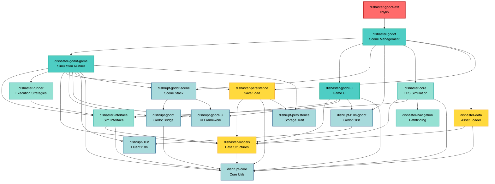

# Dishaster Game Architecture

## Overview

Dishaster is a canteen dining simulation game built with Rust and Godot Engine. The architecture follows a clean separation of concerns with multiple layers:

1. **Core Simulation Layer** - Engine-agnostic ECS-based simulation
2. **Interface Layer** - Communication interface between simulation and presentation
3. **Data Layer** - Asset loading and model registry
4. **Persistence Layer** - Save/load game progress
5. **Godot Integration Layer** - Game engine bindings and UI
6. **Framework Libraries (dishrupt-\*)** - Reusable utilities

## Framework Libraries (dishrupt-\*)

### dishrupt-core

- **Purpose**: Core utilities and abstractions
- **Contains**:
  - `EntityId` - cross-boundary entity reference
  - Display traits and asset management
  - Model registry system (type-safe data storage)
  - Bevy ECS utilities and component wrappers
- **Dependencies**: `bevy_ecs`, `bevy_math`

### dishrupt-persistence

- **Purpose**: Generic persistence trait
- **Contains**:
  - `Persistable` trait for serialization
  - `PersistentStorage` trait (filesystem backend)
- **Dependencies**: Minimal

### dishrupt-l10n

- **Purpose**: Localization with Fluent
- **Contains**: Fluent template manager for i18n
- **Dependencies**: `fluent`, `fluent-templates`

### dishrupt-l10n-godot

- **Purpose**: Godot localization integration
- **Contains**: Localized UI nodes for Godot
- **Dependencies**: `dishrupt-l10n`, godot

### dishrupt-godot

- **Purpose**: Godot-Bevy ECS bridge
- **Contains**:
  - Display system for syncing ECS transforms to Godot nodes
  - Asset loading utilities
  - Input handling
- **Dependencies**: `dishrupt-core`, godot, `bevy_ecs`

### dishrupt-godot-ui

- **Purpose**: Generic UI framework for Godot
- **Contains**:
  - GUI request system
  - UI node helpers and macros
  - Signal integration
- **Dependencies**: godot, `signals2`

### dishrupt-godot-scene

- **Purpose**: Scene management framework
- **Contains**:
  - Scene stack for multi-scene navigation
  - Scene procedures for transitions
  - Scene lifecycle management
- **Dependencies**: `dishrupt-godot`, `dishrupt-godot-ui`

## Game-Specific Crates (dishaster-\*)

### dishaster-models

- **Purpose**: Core data structures and game models
- **Contains**:
  - Diner personality, behavior, and memory models
  - Canteen, dish, table, window configurations
  - Level definitions and randomization parameters
  - Diner pool management (persistent across days)
- **Dependencies**: `dishrupt-core` (basic types)

### dishaster-interface

- **Purpose**: Communication interface for simulation (CQRS pattern)
- **Contains**:
  - `ISimulation` trait - main simulation API with separate command/query methods
  - `SimCommand` - state-mutating commands (StartRun, EndRun, UpdateDishPricing, Trial\*)
  - `SimQuery` - read-only queries (Distance, Distances)
  - `SimEvent` - push-style events from simulation (AgentSpawned, DayCompleted, Trial\*)
  - `SimResponse` - query responses (Distance, Distances)
  - `Snapshot` - complete state snapshot for rendering
- **Dependencies**: `dishrupt-core`, `dishaster-models`
- **Architecture**: Separates commands (write), queries (read), events (push), and responses (pull)

### dishaster-core

- **Purpose**: Main simulation engine (engine-agnostic)
- **Contains**:
  - Bevy ECS-based simulation loop
  - Diner behavior systems (spawning, decision-making, movement, dining)
  - Service systems (window queuing, serving, cooking)
  - Pathfinding and navigation integration
  - Trial/conversation system
  - RNG management for deterministic simulation
- **Dependencies**: `dishrupt-core`, `dishaster-models`, `dishaster-interface`, `dishaster-navigation`

### dishaster-navigation

- **Purpose**: Pathfinding and collision detection (standalone, no game dependencies)
- **Contains**:
  - A\* pathfinding with crowd cost fields
  - Collision detection with spatial hash grid
  - Euclidean Distance Transform for obstacle avoidance
  - Movement interpolation utilities
- **Dependencies**: External libs only (`pathfinding`, `edt`, `dodgy`, `grid`)

### dishaster-data

- **Purpose**: Asset loading from RON files
- **Contains**:
  - Data loader for canteens, dishes, levels, tables, etc.
  - GameModelRegistry builder
  - Trial corpus loading (questions, responses)
  - Validation and error handling
- **Dependencies**: `dishrupt-core`, `dishaster-models`

### dishaster-persistence

- **Purpose**: Save/load game progress
- **Contains**:
  - `UserProgress` - player save file structure
  - `ProgressService` - high-level save/load API
  - Diner pool persistence (profiles across days)
  - Player stats, canteen layout state
  - Day progression and seed management
- **Dependencies**: `dishrupt-core`, `dishrupt-persistence`, `dishaster-models`

### dishaster-runner

- **Purpose**: Simulation execution strategies
- **Contains**:
  - `SimulationRunner` trait - abstraction over execution modes
  - `SyncSimulationRunner` - synchronous, manual tick control for testing/debugging
  - `AsyncSimulationRunner` - asynchronous execution in background thread (feature-gated)
  - `SnapshotFrame` - bundled snapshot with events and query responses
- **Dependencies**: `dishaster-interface`, `fibre` (optional, for async)
- **Features**: `threaded` - enables async runner with background thread execution

### dishaster-godot-ui

- **Purpose**: Game-specific UI components for Godot
- **Contains**:
  - Start menu, settlement screen, time stats
  - Dish price editor, trial dialog UI
  - Layout management for in-game HUD
  - Request types (GameRequest, AppRequest)
- **Dependencies**: `dishrupt-core`, `dishrupt-godot`, `dishrupt-godot-ui`, `dishrupt-l10n-godot`, `dishaster-models`

### dishaster-godot-game

- **Purpose**: Bridge between simulation and Godot presentation
- **Contains**:
  - `Game` - manages simulation runner and display
  - Display controllers for agents and dishes
  - Event processing and presentation
  - Performance tracking
  - Debug visualization overlays
- **Dependencies**: `dishrupt-*` (godot libs), `dishaster-models`, `dishaster-interface`, `dishaster-persistence`, `dishaster-runner`

### dishaster-godot

- **Purpose**: Main Godot integration entry point
- **Contains**:
  - Scene management (StartScene, GameScene)
  - Scene procedures (level transitions)
  - Data initialization
  - Progress service setup
- **Dependencies**: All presentation layers + `dishaster-core`, `dishaster-data`, `dishaster-persistence`

### dishaster-godot-ext

- **Purpose**: GDExtension library (cdylib)
- **Contains**: Minimal entry point for Godot to load the extension
- **Dependencies**: `dishaster-godot`

## Dependency Graph



## Architecture Layers

### **Layer 1: Core Simulation (Engine-Agnostic)**

- `dishaster-core` - Main ECS simulation
- `dishaster-models` - Pure data structures
- `dishaster-navigation` - Pathfinding algorithms
- `dishaster-interface` - Communication interface (CQRS)
- `dishaster-runner` - Execution strategies (sync/async)

**Philosophy**: Core simulation can run headless, deterministic, and testable without any Godot dependency. The interface layer enforces clear separation between commands (write), queries (read), events (push), and responses (pull). The runner layer provides flexible execution modes for different use cases (testing, production, debugging).

### **Layer 2: Data & Persistence**

- `dishaster-data` - Load game assets from files
- `dishaster-persistence` - Save/load player progress

**Philosophy**: Separate data loading from runtime simulation for hot-reloading and modding support.

### **Layer 3: Presentation (Godot Integration)**

- `dishaster-godot-game` - Wraps simulation, handles display updates
- `dishaster-godot-ui` - Game-specific UI components
- `dishaster-godot` - Scene management and app lifecycle

**Philosophy**: Presentation layer consumes snapshots from simulation and sends commands back. One-way data flow.

### **Layer 4: Framework (dishrupt-\*)**

Reusable utilities that could be extracted into separate libraries:

- ECS-Display bridge (`dishrupt-godot`)
- UI framework (`dishrupt-godot-ui`)
- Scene management (`dishrupt-godot-scene`)
- Localization (`dishrupt-l10n*`)
- Persistence trait (`dishrupt-persistence`)

## Data Flow

### Command-Query Responsibility Segregation (CQRS)

```text
┌─────────────────────────────────────────────────────────────┐
│                         CLIENT                               │
│  User Input → Godot UI → GameRequest → Game                 │
└─────────────────────────────────┬───────────────────────────┘
                                  │
                    ┌─────────────┴─────────────┐
                    ↓                           ↓
              SimCommand                    SimQuery
            (State Mutation)              (Read Only)
                    │                           │
                    ↓                           ↓
┌─────────────────────────────────────────────────────────────┐
│                       SIMULATION                             │
│                      ECS Systems                             │
│   • Command Handler (mutates state)                         │
│   • Query Handler (reads state)                             │
└─────────────────────────────────┬───────────────────────────┘
                                  │
                    ┌─────────────┴─────────────┐
                    ↓                           ↓
               SimEvent                   SimResponse
           (Push Notifications)         (Query Results)
                    │                           │
                    ↓                           ↓
┌─────────────────────────────────────────────────────────────┐
│                    PRESENTATION                              │
│  Poll Events/Responses → Display Update → Godot Scene       │
└─────────────────────────────────────────────────────────────┘
```

**Key Points**:

1. **Commands** (`SimCommand`): State-mutating actions (StartRun, EndRun, UpdateDishPricing, Trial\*)

   - Fire-and-forget or trigger events as side effects
   - Examples: `StartRun`, `EndRun`, `TrialStart(EntityId)`

2. **Queries** (`SimQuery`): Read-only state inspection (Distance, Distances)

   - No side effects, returns `SimResponse`
   - Examples: `Distance(Vec2)` → `SimResponse::Distance(Option<f32>)`

3. **Events** (`SimEvent`): Push notifications from simulation to client

   - Broadcast state changes asynchronously
   - Examples: `AgentSpawned`, `DayCompleted`, `TrialIntro`

4. **Responses** (`SimResponse`): Pull results for queries

   - Direct answers to client queries
   - Examples: `Distance(Some(10.5))`, `Distances(DistancesResponse { ... })`

5. **Snapshots**: Complete immutable state capture for rendering (60 TPS default)

### Trial System (Stateful Interactions)

Trial commands are special - they mutate state AND trigger events:

- `TrialStart(EntityId)` → mutates session state → emits `SimEvent::TrialIntro`
- `TrialLaunch` → emits `SimEvent::TrialLeftSpeak`
- `TrialRespond(usize)` → updates session → emits `SimEvent::TrialRightSpeak`
- `TrialProceed` → state machine advance → emits next event or `SimEvent::TrialEnd`

These follow a **request-response dialogue pattern** where each command drives the conversation forward.
