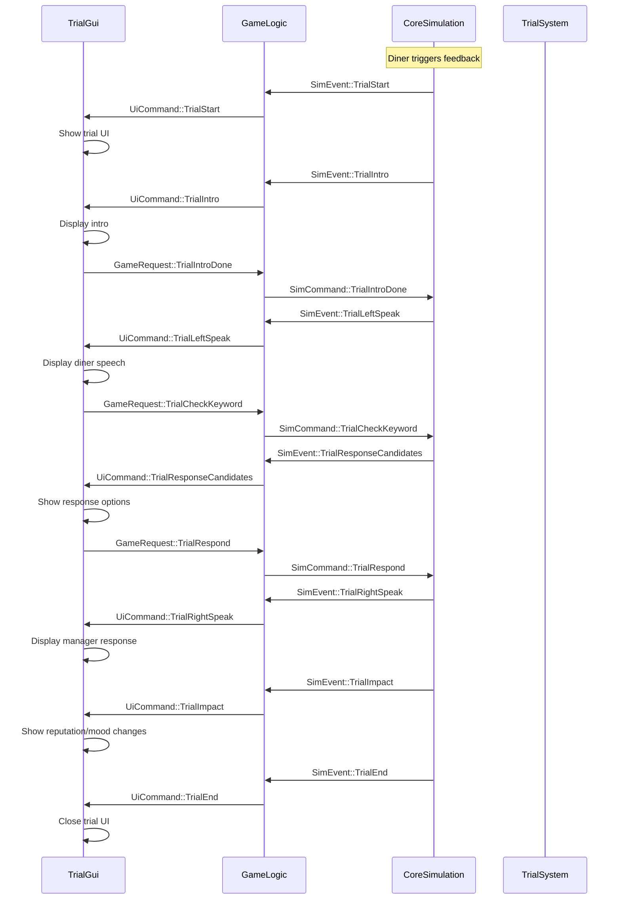
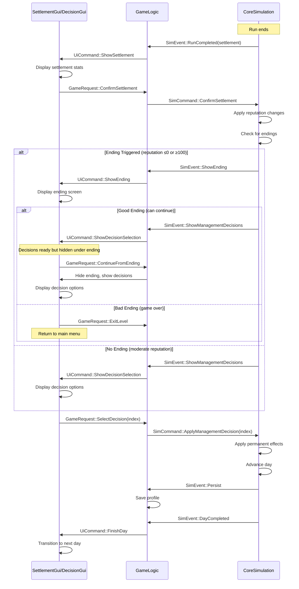
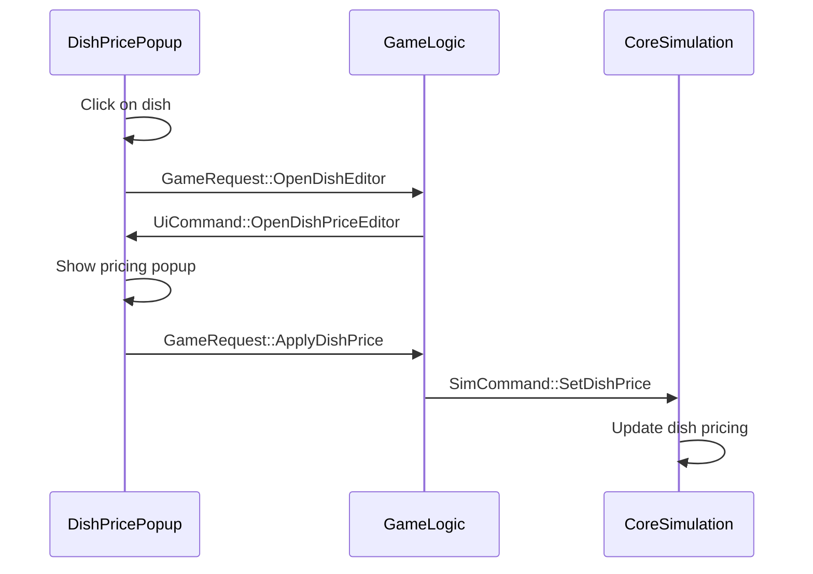
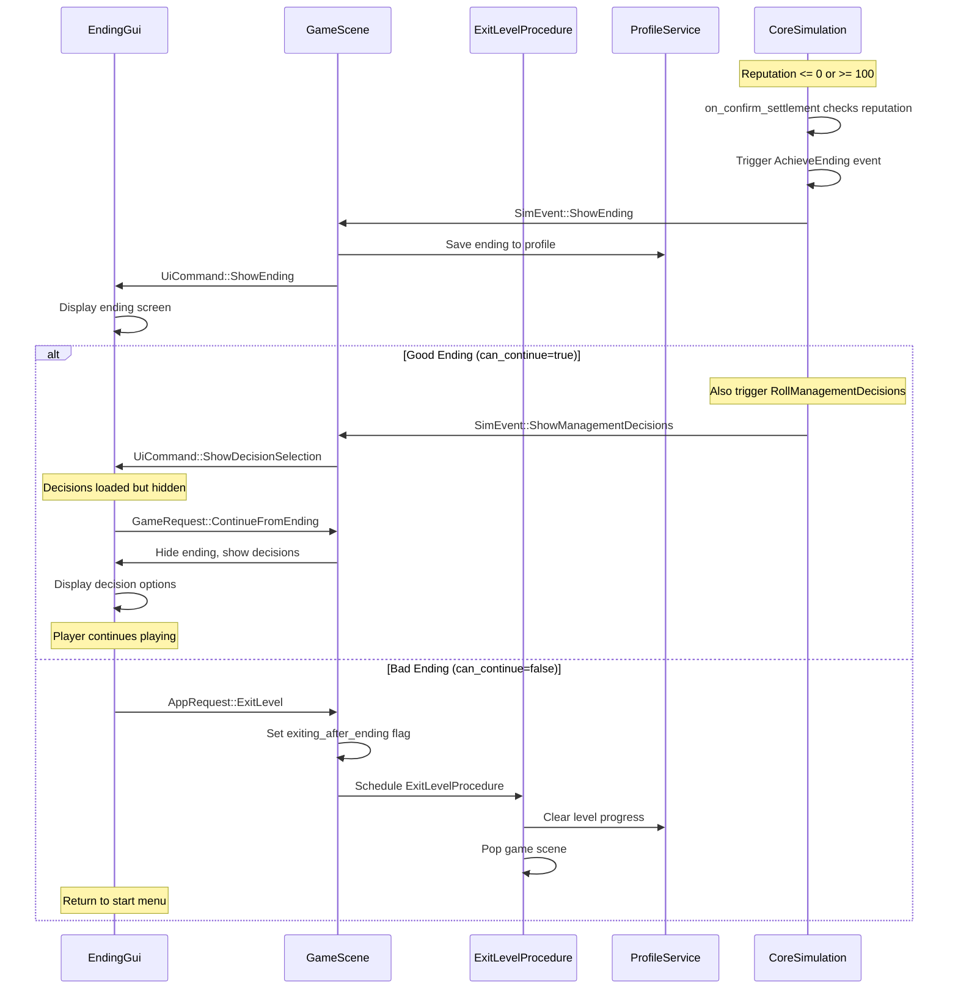
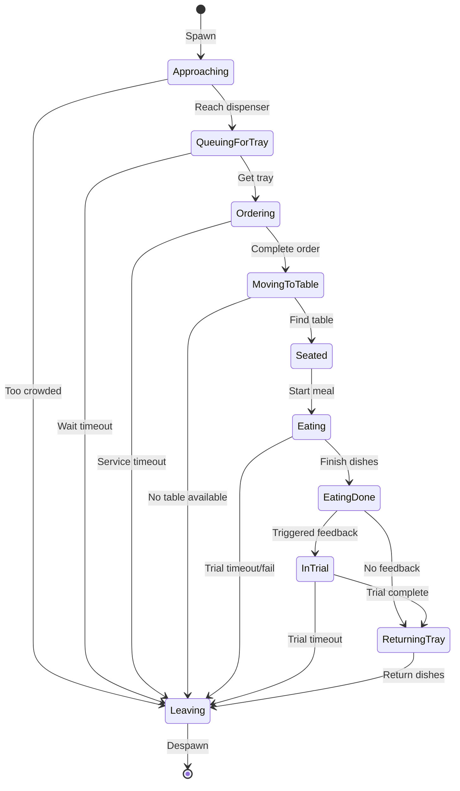
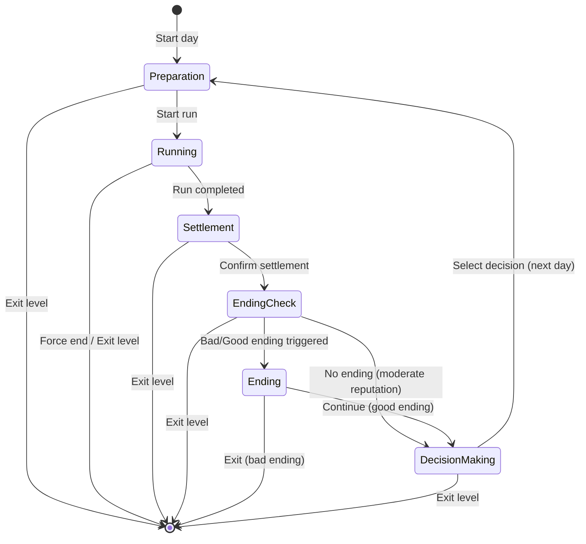

# Architecture & Messaging

## Layer Communication

The game follows a strict layered architecture with unidirectional messaging:

```text
UI Layer (Godot) → Game Logic → Core Simulation
                 ← Commands   ← Events
```

## Sequence Diagrams

### Trial System Flow



### Settlement and Management Decision Flow



### Dish Pricing Flow



### Ending Flow



## State Diagrams

### Diner State Transitions



### Day Phase Transitions



## Key Principles

1. **Unidirectional Flow**: UI never directly modifies game state
2. **Event-Driven**: Core emits events, UI responds with commands
3. **State Isolation**: Each layer owns its state
4. **Persistence Boundary**: Only Game layer interacts with ProfileService
5. **Progress Separation**: Level progress cleared on ending exit, profile data preserved

## Key Principles

1. **Unidirectional Flow**: UI never directly modifies game state
2. **Event-Driven**: Core emits events, UI responds with commands
3. **State Isolation**: Each layer owns its state
4. **Persistence Boundary**: Only Game layer interacts with ProfileService
5. **Progress Separation**: Level progress cleared on ending exit, profile data preserved
